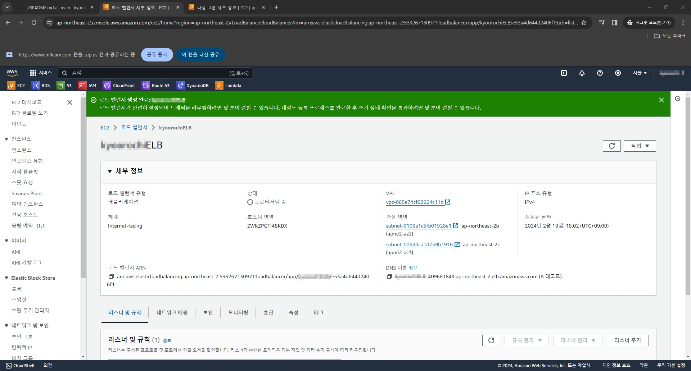
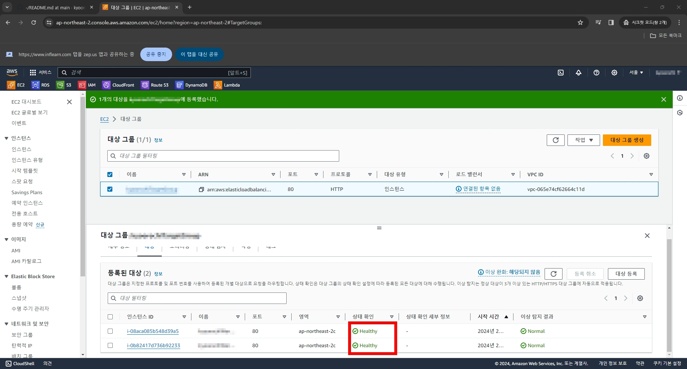

# 1. EC2 인스턴스 생성

# 2. EC2 인스턴스 주소 확인

# 3. 블로그 페이지 접속

# 6. 대상 그룹 생성

# 6. ELB 생성

# 7. ELB 활성화 확인

# 8. 대상그룹 상태 확인

# 9. DNS 주소로 블로그 접속

# 10. 인스턴스 추가 후 대상그룹 상태확인

# 11. 관리자 페이지 접속을 위해 시스템 로그를 통해 비번을 확인하자

# 12. 관리자 페이지 접속 화면

# 13. 포스팅을 새로 하나 하고 확인

# 14. 글이 있었는데요

# 15. 없었습니다 (새로고침 여러번 하니까)

# 16. 테스트 끝났으니 마무리 작업. ELB 지우고~

# 17. 대상그룹도 지우고~

# 18. 인스턴스도 종료 시키고 더블체크로 돈 새나갈 구멍 막으면 끝.

