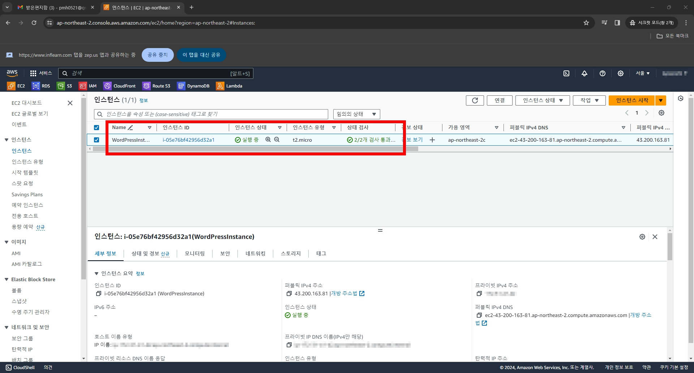
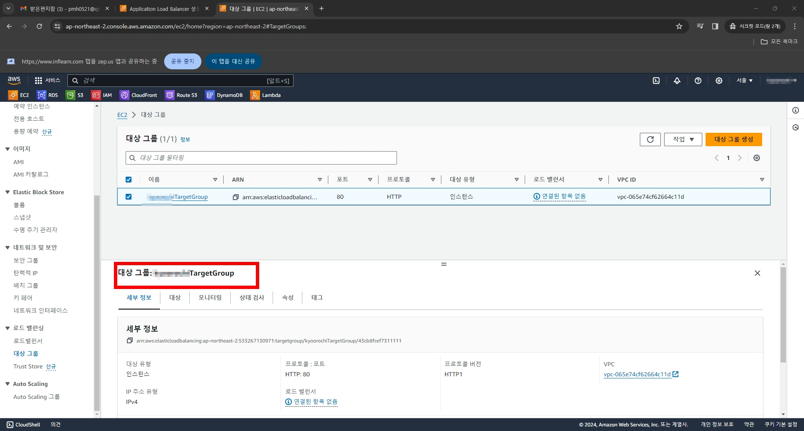
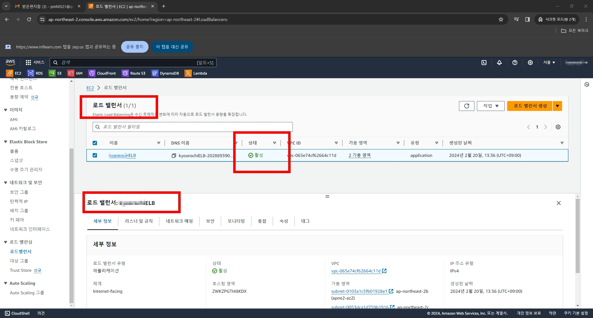
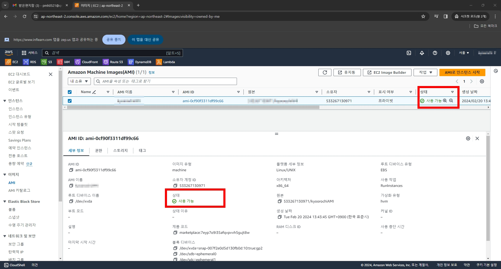
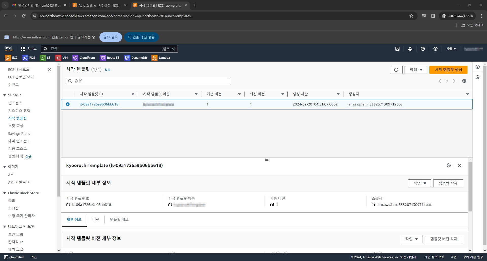
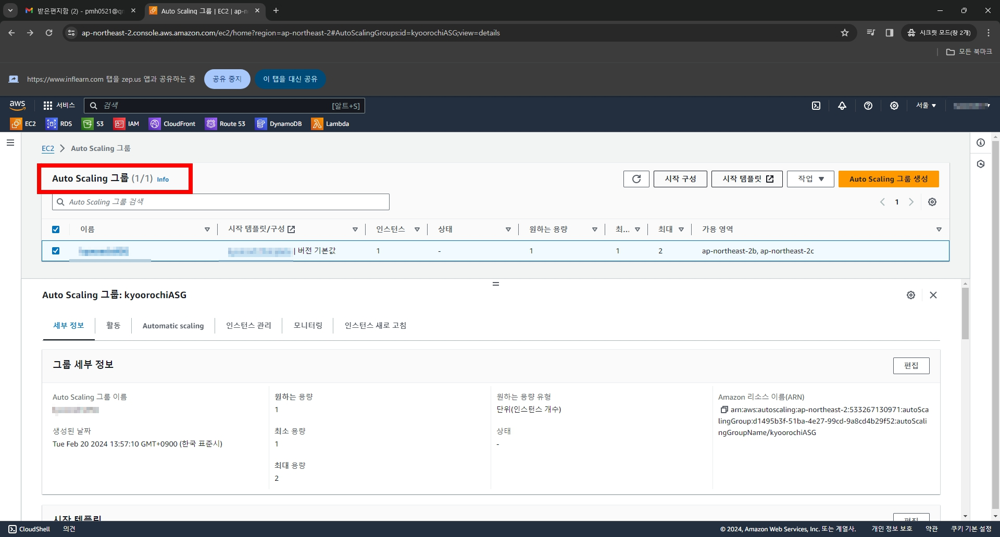
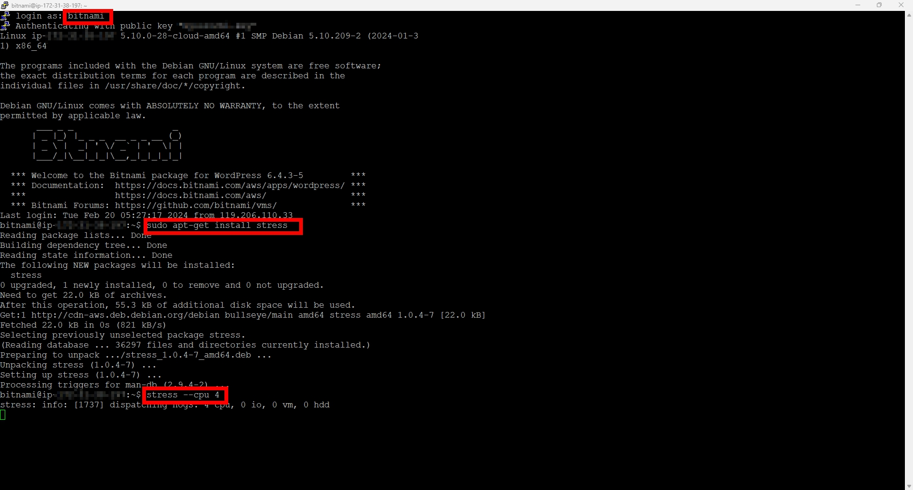
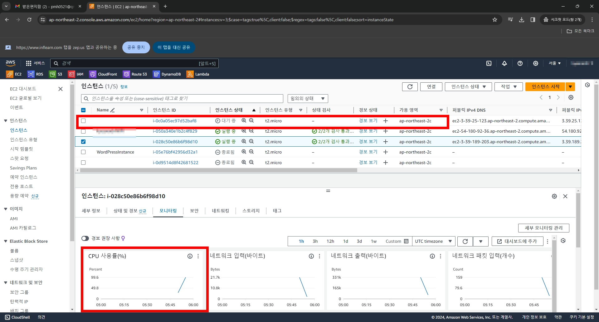

# 1. ASG를 생성하기 위해 인스턴스를 생성한다. (Word Press, bitnami)

# 2. ELB를 생성하자. 우선 진행하다가 나오는 Target Group도 생성하자

# 3. ELB 생성완료

# 4. AMI도 생성

# 5. AMI도 생성

# 6. ASG 생성완료

# 7. 인스턴스에 스트레스 줘보기

# 8. 스트레스를 주니 인스턴스를 자동적으로 하나 추가하는 것을 확인할 수 있다

# 9. 확인되었으니 인스턴스 종료하고 생성한 것들 중 키페어를 제외한 모든걸 삭제하자
