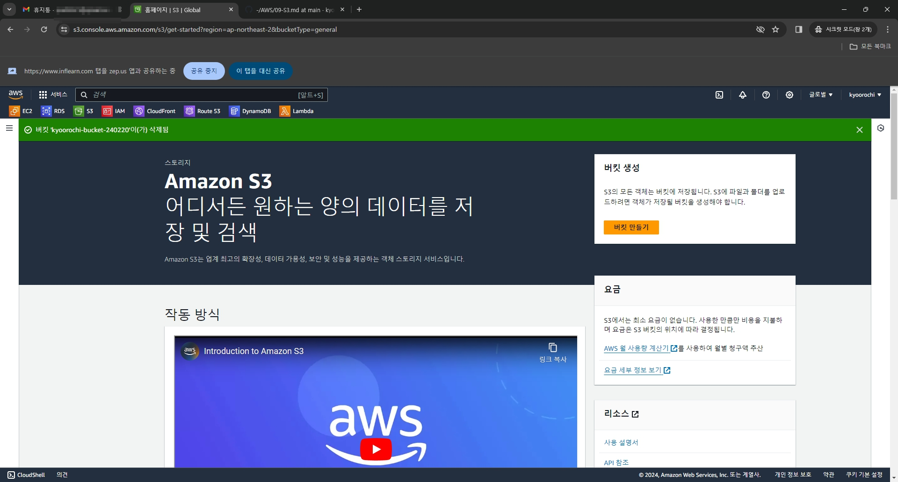

# 1. 생성해 둔 버킷에 웹사이트 호스팅을 활성화 시키자
  - 그러나 html 파일이 없기에 만들어야 한다.
  - 메모장으로 간단한 html 태그를 사용하여 테스트용을 하나 만들자.

# 2. index.html을 s3 메인에 업로드 후 버킷 화면

# 3. 접속을 시도하면 접근 권한이 없기에 막힌 모습을 보여준다
  - 권한하고 정책 설정하러 이동하자

# 4. 권한 및 정책 설정 후 다시 접속한 화면
  - 아마존이 이상한건가.. 한글은 저렇게 깨져서 나오는 단점이 있다.

# 5. 버킷을 비운 뒤 버킷을 삭제한 뒤의 화면. 정리 끝.

