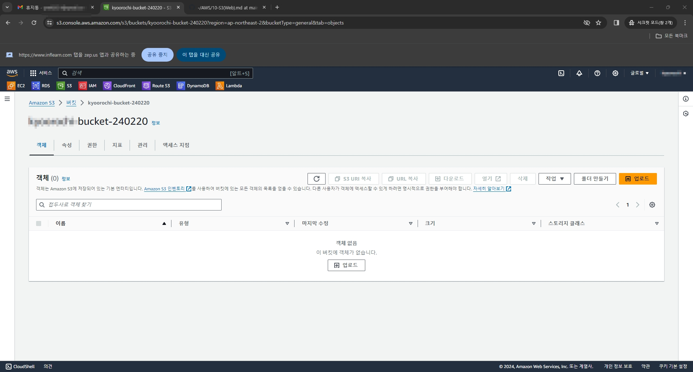
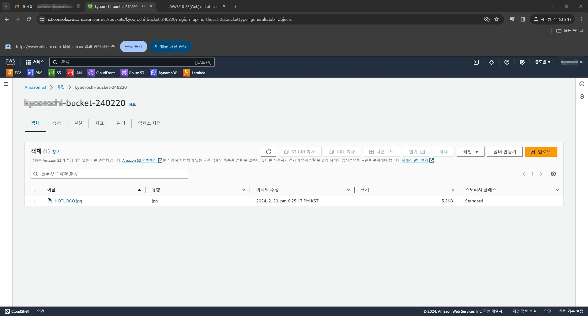
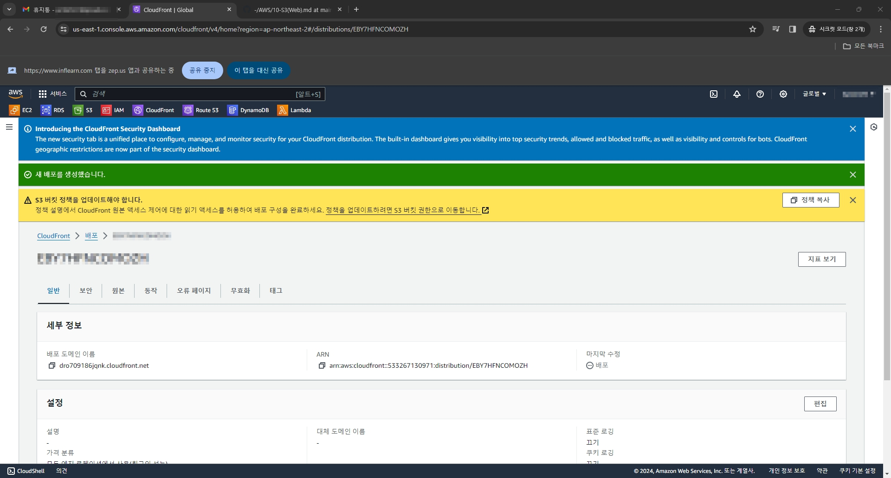
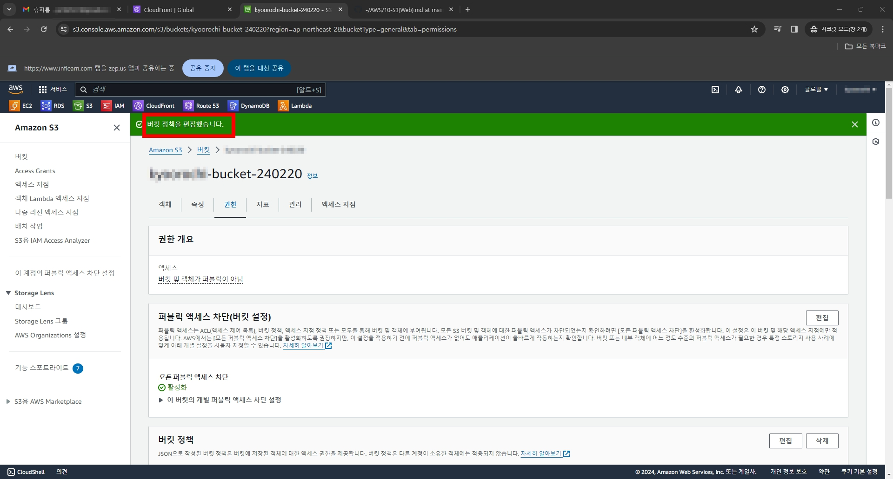
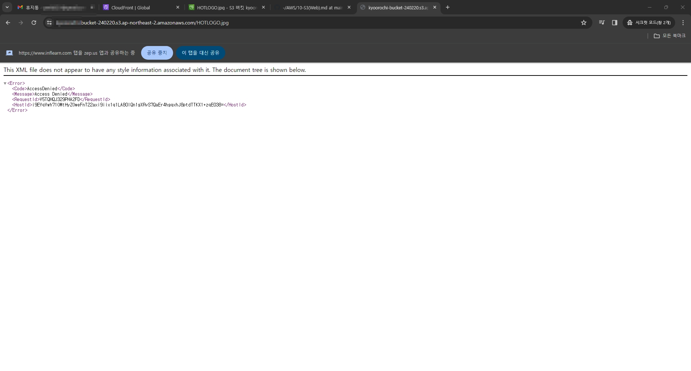
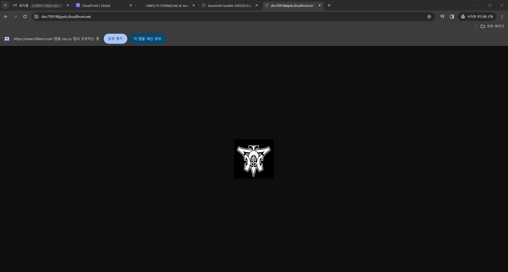
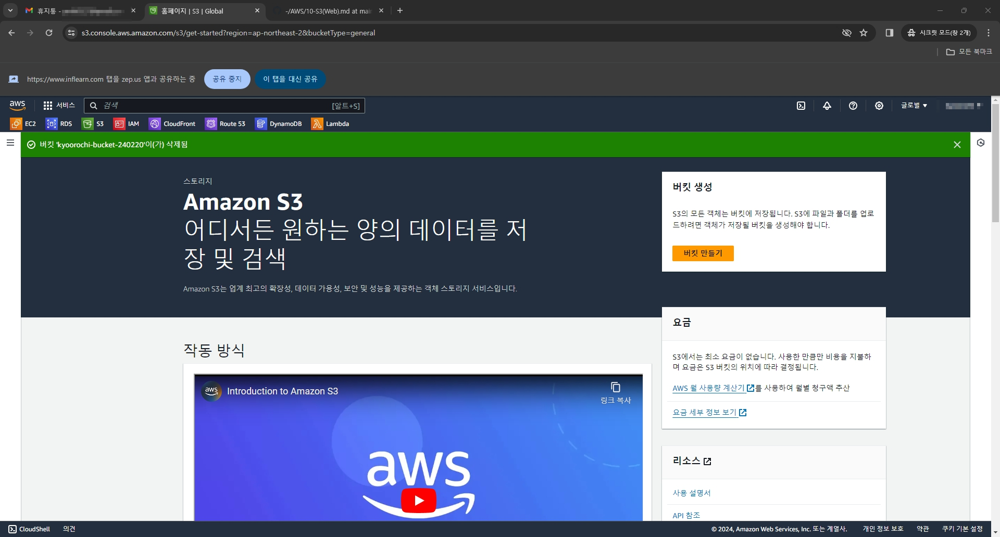

# 1. CloudFront를 만들기 전 버킷부터 생성한다

# 2. 배포 테스트를 위해 파일 하나를 업로드 한다

# 3. 배포 생성 후 정책을 만들자

# 4. 정책 편집 완료

# 5. 객체 URL로 접근시 Access Denied 발생한다

# 6. CloudFront로 접근하면 정상적으로 나온다

# 7. 배포 비활성화를 하고 몇 분 지나서 삭제한다

# 8. S3의 버킷도 비우고 삭제하면 정리된다

