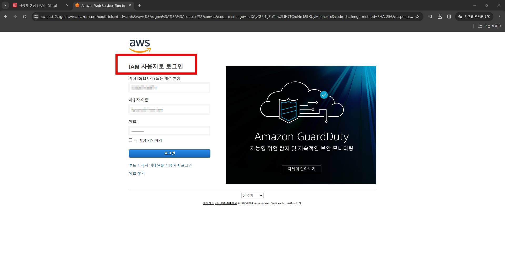

# 1. IAM 사용자 생성

# 2. 생성한 IAM 사용자로 콘솔 홈 로그인

# 3. 로그인에 성공하면 비번 바꾸는 창이 나온다.
  -  생성할 때 설정했으니까

# 4. 콘솔 홈에 접속 성공

# 5. EC2 인스턴스 생성 시도, 그러나 실패
  - EC2 Read Only 권한만 줬으니까

# 6. IAM 그룹생성
  - EC2 Full Access 권한도 줬다

# 7. 권한을 받은 뒤 생성 재시도로 만든 인스턴스

# 8. IAM 사용자 삭제 전에 인스턴스 종료시키자

# 9. IAM 사용자 삭제

# 10. 사용자 삭제 완료

# 11. 그룹도 삭제 완료

