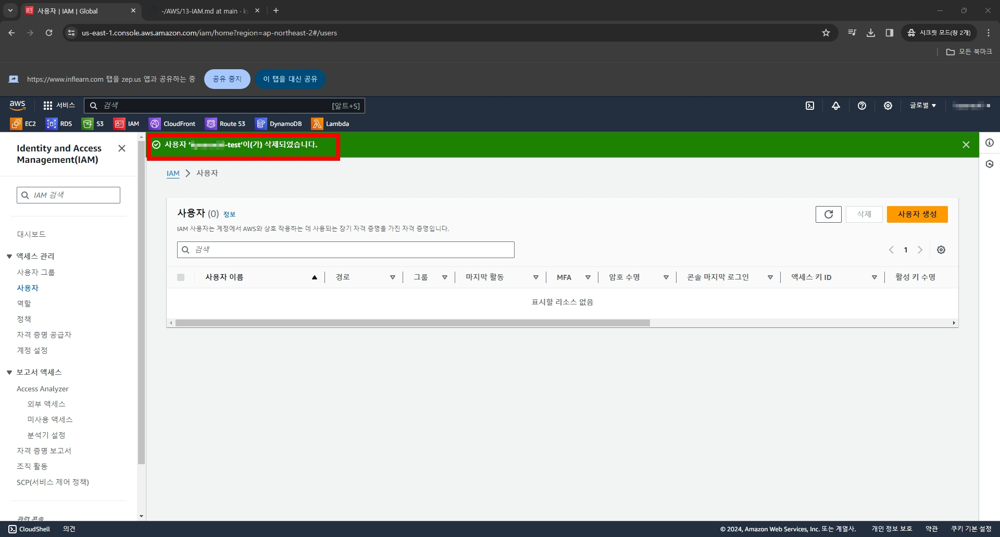

# 1. IAM 사용자 생성후 액세스키도 생성함

# 2. 그 다음 진행방법을 몰라 찾다가 CLI 프로그램을 설치함

# 3. 그리고는 CMD 창에서 저리하니.. 어....?

# 4. 만들어졌네?

# 5. 명령어를 한번 쳐보고 자격증명 파일을 삭제한다
  - 버킷은 만든적 없으니 그냥 명령어만 쳐봤다
  - 자격증명파일은 저렇게 삭제해도 되겠지..?

# 6. IAM으로 돌아와 생성했던 사용자도 삭제한다
  - CLI 프로그램도 지움 (당분간은 사용할 일이 없어서.. 크진 않지만 용량도 잡아먹으니
  - %userprofile% 에 있는 .aws 폴더도 삭제하였다

