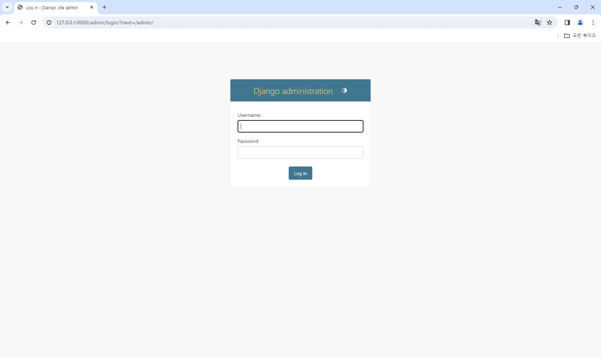

# 1. 1일차 과제
  - 강의영상을 보며 차근차근 따라했는데 뭐고? poetry shell을 쳤는데 강의영상과 다르다.
    
    
  - 뭐가 문제인지 몰라 우선은 최상위루트 폴더 밑에 Django 폴더를 만들어 강의 따라갔다.
  - 현재 업로드된 파일은 이걸 기준으로 올린 과제 결과물이다.
    

  - 뭐 때문에 그런건지 전혀 모르는 상태로 복습삼아 기존꺼로 돌아와봤다. (새로 만든건 아직 안지움)
  - poetry shell 은 안먹히고, 그 다음꺼인 서버 오픈 명령어를 쳤는데 응? 뭐지?
    
  
  - 열리네...? 설마 그럼 어드민도?
    

  - 헐.. 혹시 모르니 복습삼아 더 가보자
    

  - 따로 만들었던 폴더(깃에 업로드된 파일들)을 붙여넣고 시험해봤는데 어드민 페이지 접속이 되었다.
    

  - URL & View도 가능했다. 내일 진도를 이대로 갔다가 안되면 이동해서 해봐야겠다.
    

  - 기존에서 내가 사용하던 폴더에서나 새로만든 폴더에서나 venv 폴더는 최상단격에 있었다.
  - 기존꺼는 E:\학원수업\venv 였고 새로 만든 폴더는 E:\Django-Study\.venv
  - 둘 다 최상단격에 위치했기에 가상환경이 활성화되어 컨트롤했던게 아닐까 추측해본다
  - 이후 강의 진도에 따라 다를 수 있으니 두고 봐야될 듯..
