# 4. 4일차 과제
  - 강의 영상을 보며 차근차근 따라갔다. 우선 워크벤치로 테이블 만들기부터
  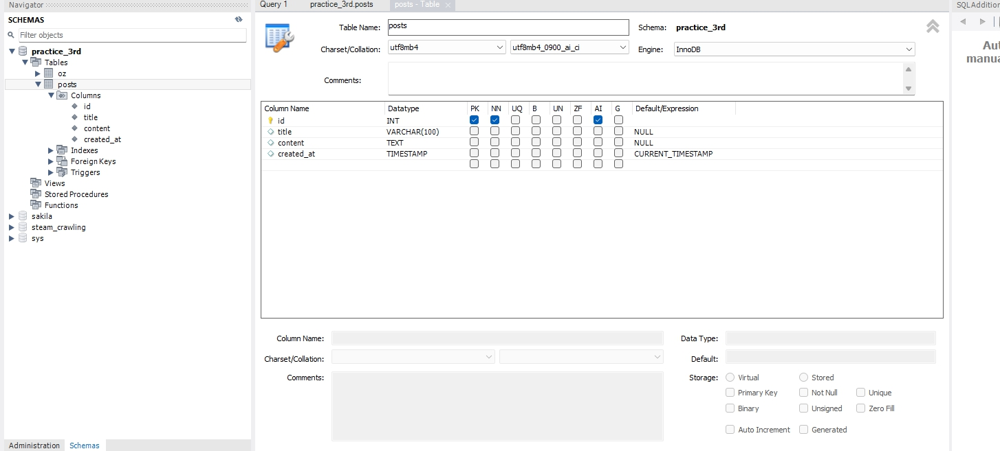

- 코드도 따라치고 (표출 문구 부분은 내 입맛에 맞게 수정) 웹페이지 구현
  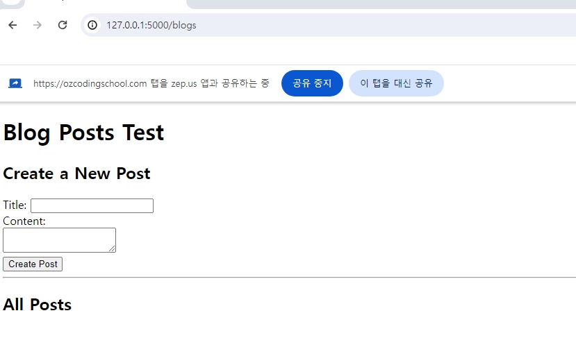
  
  - VSC에서도 200번으로 나오니 정상작동 되는 것을 확인할 수 있다.
  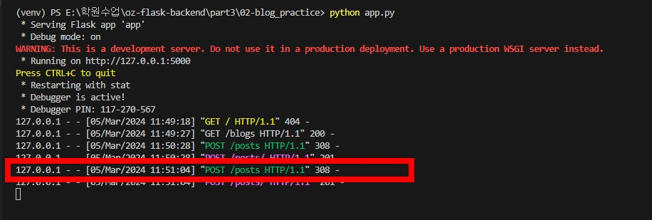

- 웹페이지에서 글쓰기를 했는데, 쓴 글이 표시가 안된다. 뭐지?
- VSC로 갔더니 308 에러라는데.. 검색해도 정확히 뭔지 모르겠다.
- 쓴 글이 사라진걸까?
  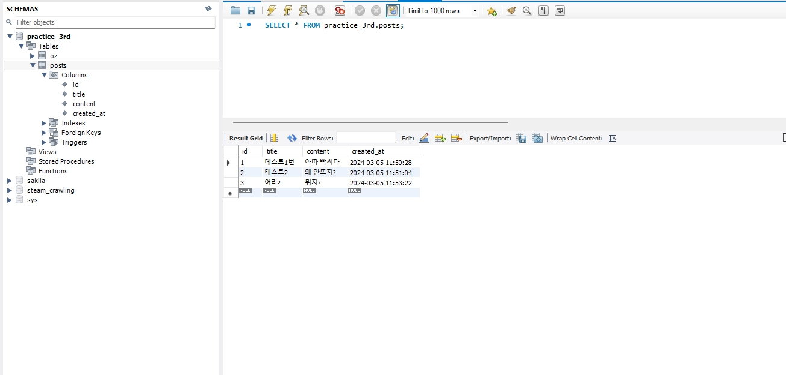
  
  - 워크벤치로 들어와서 살펴보니 DB에는 다행히 남아있었다.
  - 왜 그런지 찾아서 수정해야 될 듯 하다.
  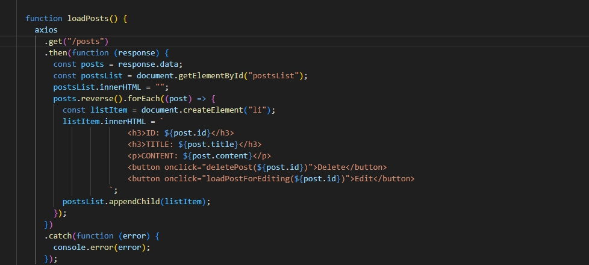

----------------------------------------------------------------------------------------
# 3. 3일차 과제
  - 뭐가 문제일까. 까막눈은 모르겠다..
  - db쪽의 문제일까, 아니면 어디서 오타가 난걸까
  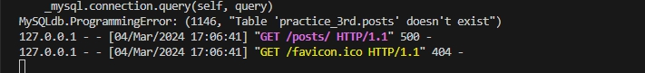
  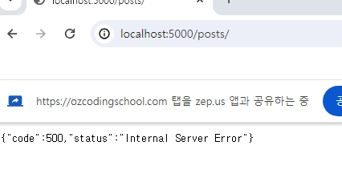

  - 문제점을 찾았다. sql 문구로 쓰일 부분이 문제였다.
  - 워크벤치에 oz라고 테이블을 만들었는데 따라할 때 이 부분을 내꺼로 지정하지 않아서 그러했다.
  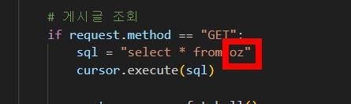

  - 수정하고 웹페이지를 다시 띄우니 500 에러는 사라졌고, vsc에서도 200 코드가 뜨며 정상적으로 작동한다.
  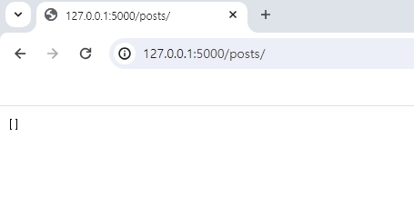
  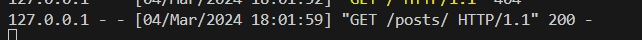
-------------------------------------------------------------------------------------
# 2. 2일차 과제
  - 포스트맨을 이용, 접속해서 넣었을 때
  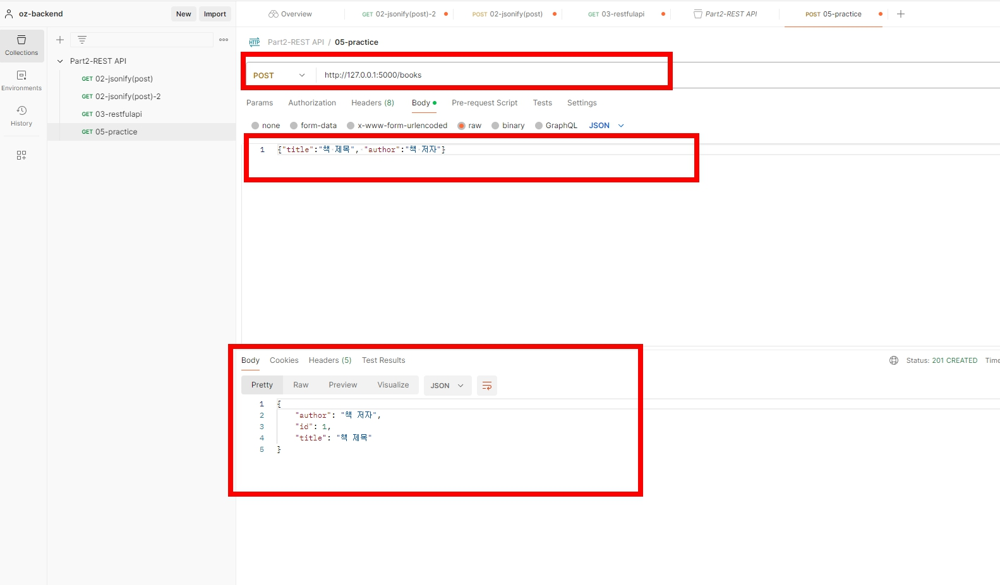

  - 여러개를 만들고 나서 GET 요청을 하여 조회
  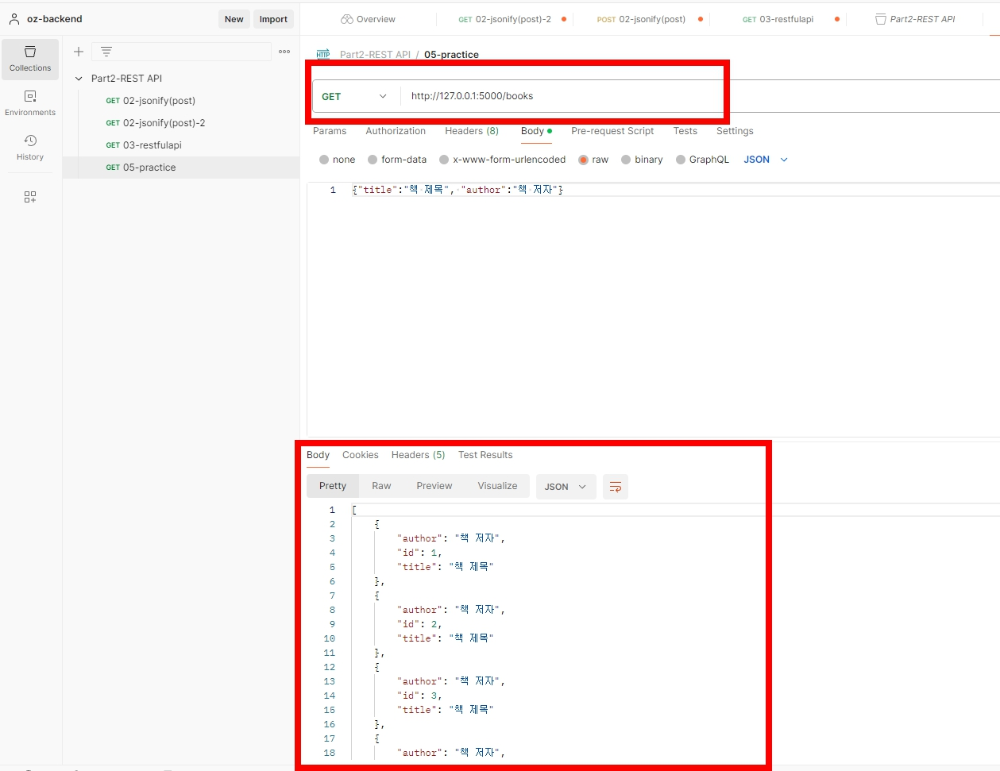

  - 3번 id 항목을 수정(PUT)하고 있는 부분
  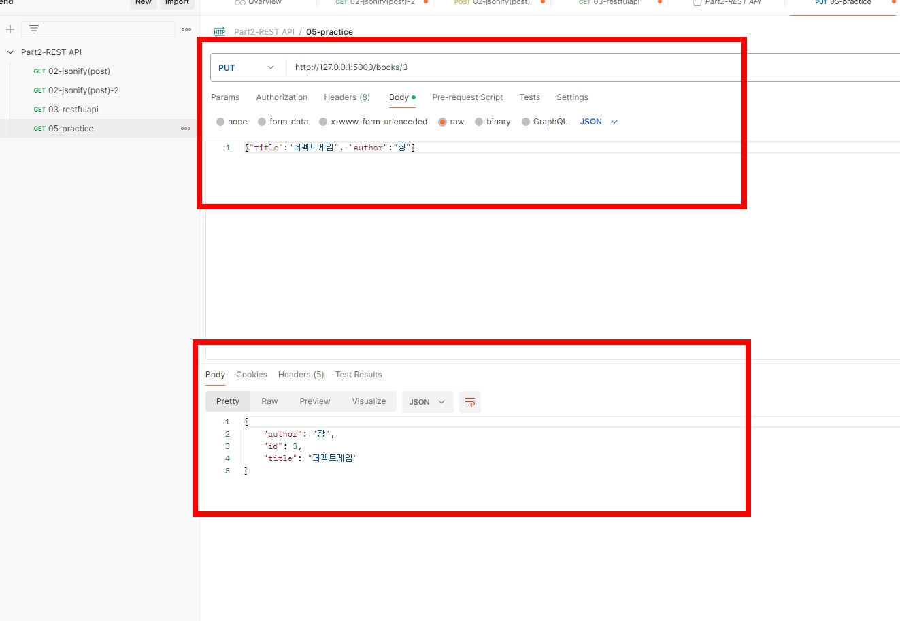

  - 4번 id 항목을 삭제하고 조회하면 404 Not Found가 나온다.
  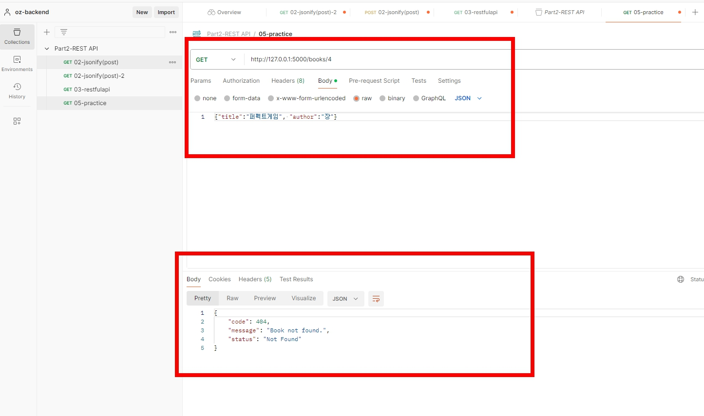

----------------------------------------------------------------------------------------
# 1. 1일차 과제
  - Flask와 Jinja 템플릿을 사용한 사용자 목록 웹 페이지 만들어보기
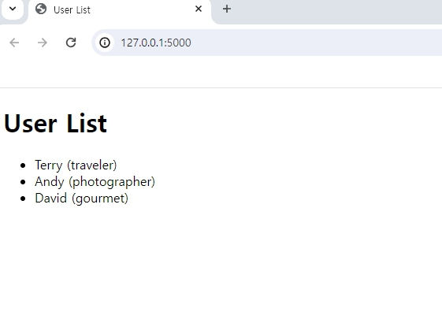
